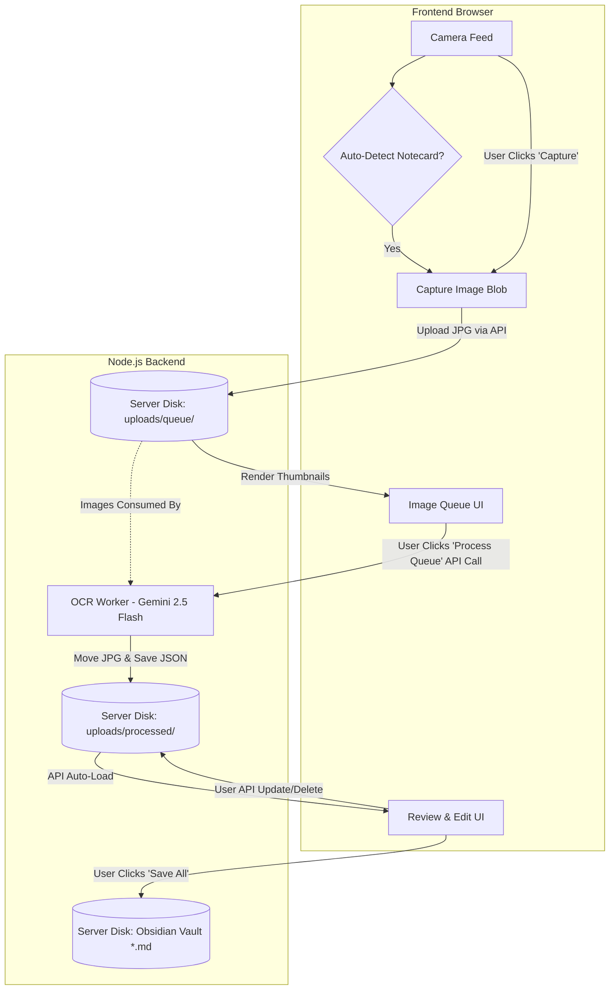

# Slipbox OCR

Auto-detecting notecard OCR system with computer vision detection and Google Gemini AI for text recognition.

## Features

- **Auto-Detection**: Automatically detects when a notecard is in view (no manual capture needed)
- **Fast CV Detection**: 7-14ms detection using brightness-based computer vision
- **High Accuracy**: 100% detection accuracy - recognizes notecards, ignores faces/people
- **Gemini AI OCR**: Uses Google Gemini for high-quality handwriting recognition
- **Auto-Save**: Saves recognized text as Markdown files
- **Live Preview**: Real-time camera feed with capture history

## Tech Stack

**Core Dependencies:**
- `express` - Web server
- `sharp` - Image processing for detection
- `@google/generative-ai` - Gemini API client
- `multer` - File upload handling
- `dotenv` - Environment variables

**Dev Dependencies:**
- `nodemon` - Auto-reload during development
- `livereload` - Browser auto-refresh

## How It Works



1. **Capture**: When notecard detected by CV (or manually captured), it captures a high-quality image.
2. **Queue**: Images sit in a local disk queue `uploads/queue` so you don't lose scans if the browser crashes.
3. **Background Processing**: Sends queued images to Gemini 2.5 Flash for async text extraction.
4. **Review**: Caches extracted text into `uploads/processed` so you can manually edit/review them safely.
5. **Save**: Outputs as timestamped Markdown files with Frontmatter directly into your Obsidian Vault or output directory.

### Detection Algorithm

Uses brightness-based detection instead of edge detection or LLM:
- **Brightness**: Center region must be bright (>120 out of 255)
- **Uniformity**: Center must be uniform (>0.75) - solid color, not complex
- **Contrast**: Center must be brighter than borders (>1.0 ratio)

This approach:
- ✅ Detects white notecards reliably
- ✅ Rejects faces/people (too dark, too complex, poor contrast)
- ✅ Works in various lighting conditions
- ✅ 100x faster than LLM-based detection

## Setup

### Prerequisites

- Node.js 18+
- Google Gemini API key ([get one here](https://aistudio.google.com/app/apikey))

### Installation

1. Clone the repository:
```bash
git clone <your-repo-url>
cd slipbox-ocr
```

2. Install dependencies:
```bash
npm install
```

3. Create `.env` file:
```bash
cp .env.example .env
```

4. Add your Gemini API key and Obsidian vault path to `.env`:
```
GEMINI_API_KEY=your_actual_api_key_here
OBSIDIAN_DIR=/path/to/your/Obsidian/Slipbox/Cards
```

### Running

Start the development server:
```bash
npm run dev
```

Open http://localhost:3000 in your browser.

## Usage

1. **Start Camera**: Click "Start camera" button
2. **Enable Auto-Detect**: Toggle "Auto-detect" switch or manually use the "Capture" button.
3. **Hold Up Notecard**: System will automatically detect and capture adding it to the Image Queue.
4. **Process Background OCR**: Click "Process Queue" to let Gemini extract the markdown text safely behind the scenes.
5. **Review Results**: OCR text and thumbnails appear in the Drafts queue so you can review them. 
6. **Export**: Batch push all drafts directly to your Obsidian Vault with standard Zettelkasten parameters!

## Testing

Run detection tests:
```bash
node scripts/test_all_cases.js
```

This validates detection against sample images (2 positive, 2 negative cases).

## Project Structure

```
slipbox-ocr/
├── public/              # Frontend
│   ├── index.html      # Main UI
│   ├── script.js       # Camera & detection logic
│   └── style.css       # Styles
├── server/             # Backend
│   ├── index.js        # Express server
│   ├── rectangle_detector.js  # CV detection
│   ├── gemini_vision.js       # Google Gemini OCR
│   └── storage.js             # File saving
├── output/             # Saved Markdown files
├── test_images/        # Test cases for detection
├── scripts/            # Testing utilities
└── docs/               # Documentation
```

## Configuration

### Detection Thresholds

In `server/rectangle_detector.js`, you can adjust:

```javascript
const isBright = centerBrightness > 120;      // Brightness threshold
const isUniform = centerUniformity > 0.75;    // Uniformity threshold  
const hasContrast = contrastRatio > 1.00;     // Contrast threshold
```

Lower thresholds = more sensitive (may detect non-cards)  
Higher thresholds = less sensitive (may miss cards)

## Development

### Adding Test Cases

1. Add images to `test_images/`:
   - `positive-*.png` - Should detect notecard
   - `negative-*.png` - Should NOT detect

2. Update `scripts/test_all_cases.js`

3. Run tests: `node scripts/test_all_cases.js`

### Live Reload

The dev server includes live reload - changes to frontend files auto-refresh the browser.

## Security

⚠️ **Never commit `.env` to version control**

The `.env` file contains your API key and is gitignored. Share `.env.example` instead.

## License

MIT

## Contributing

Pull requests welcome! Please ensure all tests pass before submitting.
